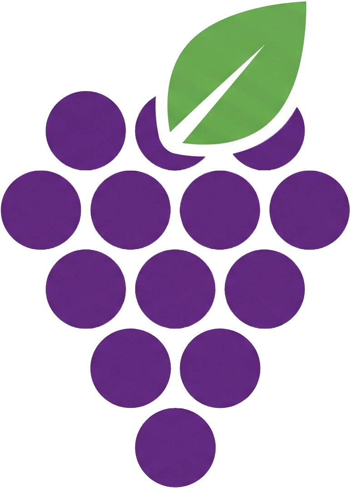

<div align="center">

  <h1> Harvest</h1>

  <p>
    <a href="https://www.djangoproject.com/"></a>
    <a href="https://htmx.org/"></a>
    <a href="https://www.sqlite.org/"></a>
    <a href="https://www.docker.com/"></a>
    <a href="https://github.com/features/actions"></a>
    <a href="https://www.cloudflare.com/"></a>
  </p>

  <p align="center"><strong>A self-hosted calendar that turns parcel notification emails into a mobile view of what's arriving, waiting, and about to expire</strong></p>

  

</div>

## About

Harvest tracks parcels from the moment they're ordered to the day they're collected. A
dedicated mailbox receives the delivery notification emails; an IMAP worker parses them and
follows each parcel through its lifecycle — ordered, shipped, ready for pickup, collected —
rendered as a mobile-first calendar, so the next pickup trip is obvious at a glance.

Three kinds of destination are handled distinctly:

- **Amazon pickup points** (Lockers and Counters) — the "ready for pickup" email carries a hard
  deadline, read straight from the message and never estimated.
- **Home deliveries** — tracked until they land; no trip and no deadline, delivery is the
  terminal state.
- **Non-Amazon drop-off points** — no email trail, so these are logged by hand.

## How it works

- **Ingestion** — a worker polls the mailbox over IMAP on a loop. Every raw email is stored
  before parsing, matched to its parcel by order and shipment id, and de-duplicated by
  `Message-ID`. Processed mail is moved to Trash so the inbox self-cleans; anything the parser
  doesn't recognise is flagged on the calendar rather than dropped. Because the scan is
  idempotent, a parser fix can be replayed over stored failures with `manage.py reprocess`.
  Every action is logged with a timestamp.
- **Calendar** — a month / fortnight / week view built from server-rendered templates and HTMX
  fragment swaps, with no JavaScript build step. Each parcel is a chip on the days that matter;
  tapping a day opens it enlarged in a modal, and each chip a card with the product name, photo,
  destination, and a link to the pickup barcode. On phones the fortnight — the default there —
  renders as a vertical agenda and the month as a dot map, so chips stay readable and tappable.
- **Manual entry** — handled by the Django admin, which doubles as the data-repair safety net.

## Stack

- **Backend** — Django + SQLite, server-rendered templates, HTMX for interactivity without a
  build step. Chosen for being opinionated: fewer ways to write the same thing keeps the code
  predictable and reviewable.
- **Ingestion** — IMAP with an App Password rather than the Gmail API, which in "Testing" mode
  expires refresh tokens weekly and would require a restricted-scope security assessment to
  publish. `BeautifulSoup` + `dateparser` do the parsing; it's written as a pure function and
  tested against real email fixtures kept out of version control.
- **Infrastructure** — Docker (a web container and an ingest worker) on a Raspberry Pi,
  published through a Cloudflare Tunnel and gated by Cloudflare Access. GitHub Actions builds
  and deploys.

## Calendar vocabulary

Each parcel renders as one or more chips, keyed by a rendering `kind` that maps onto its
lifecycle state — several kinds share one state, drawn differently by how the day relates to
the deadline:

| Chip        | Rendered as               | Lifecycle state   |
| ----------- | ------------------------- | ----------------- |
| `ordered`   | hollow dot                | in transit        |
| `shipped`   | filled dot                | in transit        |
| `estimated` | dashed box                | in transit        |
| `waiting`   | filled box                | awaiting pickup   |
| `deadline`  | red box (last safe day)   | awaiting pickup   |
| `leaves`    | red dashed box (may go)   | awaiting pickup   |
| `picked`    | muted ✓                   | picked up         |
| `delivered` | muted 🏠                   | delivered (home)  |

On a phone the month view draws these same kinds as color-coded dots (hollow = on the way,
filled = waiting, red = hurry, muted = done); reading happens in the agenda-style fortnight
view or by tapping a day.

## Getting started

```bash
uv sync
uv run python manage.py migrate
uv run python manage.py runserver       # http://localhost:8000
uv run python manage.py test packages   # test suite
```

Ingestion reads `GMAIL_IMAP_USER` and `GMAIL_IMAP_APP_PASSWORD` from the environment; the
calendar and admin run without them.

---

<div align="center">
  <p>Built with ❤️ by <a href="https://github.com/alarcia">alarcia</a></p>
</div>
